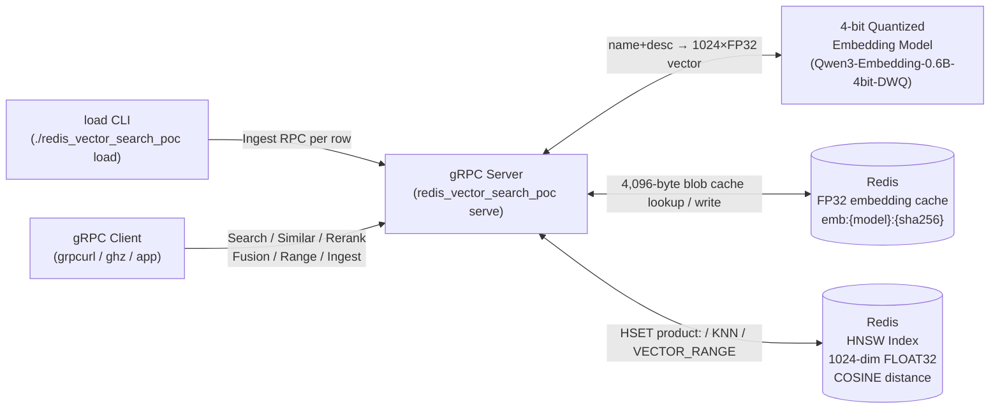
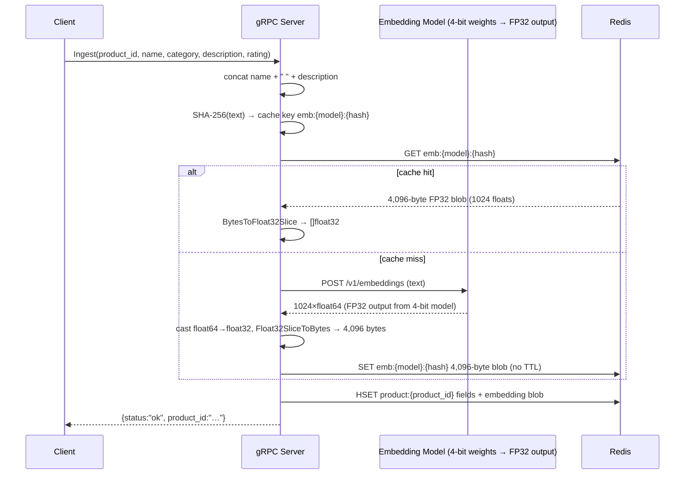
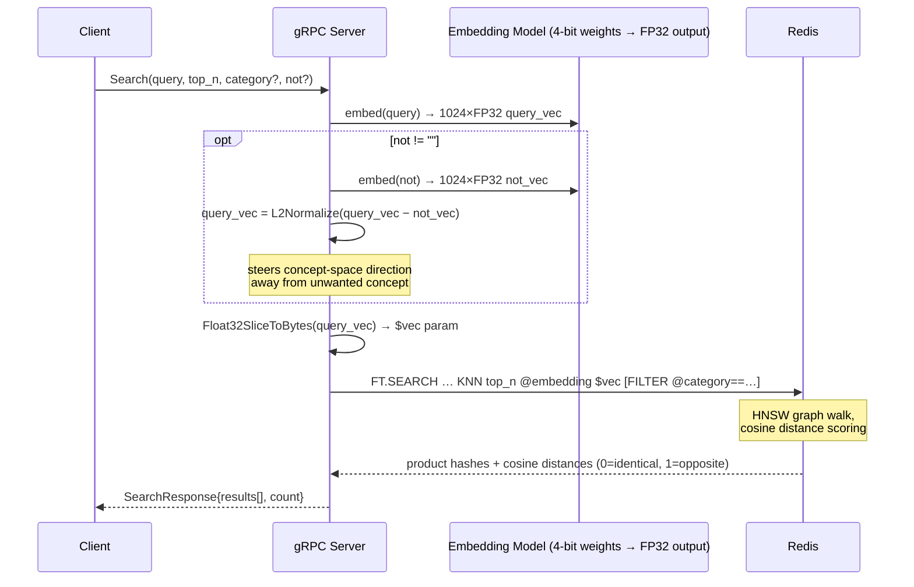

# Redis Vector Search POC

A gRPC server that embeds product data as vectors via an OpenAI-compatible embedding API, stores them in Redis using HNSW vector search, and exposes semantic search endpoints.

## Architecture



### Ingest flow



### Search flow



## Vector internals

### Representation

Every product in the catalog is reduced to a list of 1024 numbers — a `[]float32` — called its **embedding**. That list is a coordinate in 1024-dimensional space where position encodes meaning: "Julie Solid Wood Sleigh Bed" and "Pine Panel Bed Frame" end up numerically close to each other; "Julie Solid Wood Sleigh Bed" and "Stainless Steel Mixing Bowl" end up far apart.

The embedding model (`Qwen3-Embedding-0.6B-4bit-DWQ`) has its internal weights stored in 4-bit to reduce memory and speed up inference, but it always outputs FP32. Once the service receives the 1024 floats, everything downstream — caching, storage, math, search — works in FP32.

### Byte translation

Redis stores binary blobs; Go vectors are `[]float32`. Every time a vector crosses that boundary `store.go` converts between the two representations:

- **`Float32SliceToBytes`** — writes each float as its 4-byte IEEE 754 little-endian representation. 1024 floats × 4 bytes = **4,096 bytes per product**.
- **`BytesToFloat32Slice`** — reads 4 bytes at a time and reconstructs each float via `math.Float32frombits`.

The round-trip is lossless. The same 4,096-byte blob written to Redis is bit-for-bit identical when read back, which matters because even tiny floating-point drift would shift cosine distances and make cached embeddings behave differently from freshly-computed ones.

### Ingest

The text fed to the model is `product_name + " " + description` — not category or rating. Category and rating are stored as ordinary Redis hash fields alongside the vector and are only used for filtering and reranking later.

1. SHA-256 the concatenated text → check Redis for `emb:{model}:{hash}`.
2. **Cache hit**: deserialize the 4,096 bytes back to `[]float32`, skip the API call.
3. **Cache miss**: POST to the embedding API, cast the response `[]float64` → `[]float32`, write bytes to the cache key with no TTL.
4. `HSET product:{product_id}` with all fields, storing the embedding as the raw byte blob.

The cache key includes the model name, so swapping models silently bypasses old entries — they stay in Redis but are never matched. Because the key is derived from the text, identical descriptions across different product IDs share one cached embedding.

### Search

The query string goes through the same embedding path — same model, same cache check. The resulting `[]float32` is serialized to bytes and passed to Redis as the `$vec` parameter:

```
*=>[KNN 5 @embedding $vec AS __score]
```

Redis walks the HNSW graph it built at index time, comparing the query vector against stored product vectors using **cosine distance**. Cosine distance measures the angle between two vectors, ignoring magnitude — two descriptions of the same product at different lengths still land close together. The returned `__score` is cosine distance: `0` = identical direction, `1` = opposite.

#### Negative steering (`not`)

When a `not` phrase is supplied the service:

1. Embeds the phrase into its own `[]float32`.
2. Subtracts it from the query vector element-by-element (`vek32.Sub`).
3. L2-normalizes the result back to unit length (`vek32.Norm` then `vek32.DivNumber`).

```
final_vec = L2Normalize(query_vec − not_vec)
```

Subtraction moves the query point away from the unwanted concept in embedding space. Renormalizing ensures the result still behaves as a direction vector for cosine distance — HNSW assumes unit vectors. The modified vector is then passed to KNN exactly like a normal query; Redis has no awareness it was computed via subtraction.

### Similar

No embedding API call is made. The service reads the source product's stored embedding directly with `HGETALL product:{product_id}`, deserializes the `embedding` field from bytes to `[]float32`, and passes it straight to `KNNSearch` with `excludeID` set so the source product is not returned as its own top result.

This makes Similar cheaper than Search: one Redis hash read plus a KNN query, no embedding round-trip.

### Rerank

Rerank runs a larger KNN first (the `rerank_pool`, default 50 candidates) then re-scores entirely in Go using a linear blend of vector similarity and normalized rating:

```
sim  = 1 − cosine_distance
norm = (rating − min_rating) / (max_rating − min_rating)

final_score = (1 − weight) × sim + weight × norm
```

Min/max normalization is computed across the 50 candidates returned from Redis, not the full catalog. A 4.9-star product in a pool where everything is 4.7–5.0 gets a normalized rating near 1.0, while that same product in a pool spanning 1.0–5.0 scores ~0.97. Vector score drives initial recall; rating blends in at sort time in Go.

### Fusion

Each query in `queries` is embedded independently. `store.AverageVectors` then:

1. Sums each dimension across all vectors.
2. Divides element-wise by the count (mean).
3. L2-normalizes the result.

The normalized average sits geometrically between all the query concepts. Querying "standing desk", "ergonomic chair", and "monitor arm" together produces a single vector in the "productive office setup" region of concept-space — closer to products that partially match all three than to products that perfectly match just one. The L2 normalization is essential: averaging un-normalized vectors would bias toward whichever query has the largest magnitude.

### Range

Instead of returning the N closest products, Range returns everything within a cosine distance threshold. The Redis query is:

```
@embedding:[VECTOR_RANGE $dist $vec]=>[KNN {limit} @embedding $vec AS __score]
```

`VECTOR_RANGE` is the gate; the `KNN` inside it scores and orders what passed through. Because this is HNSW (approximate), products at the edge of the threshold may be missed — the graph traversal does not guarantee it visits every node within range. A `max_distance` of `0.25` corresponds to roughly a 66° angle between vectors; products at `0.26` might be genuinely relevant but are dropped. This is the tradeoff accepted with approximate nearest-neighbor in exchange for millisecond search over tens of thousands of products. Tune `EF_RUNTIME` on the index to increase recall at the cost of higher latency.

---

## Prerequisites

- Go 1.25+
- Redis 8+ with Query Engine / vector search support
- An OpenAI-compatible embedding server (defaults to `http://localhost:8000/v1/`)
- `grpcurl` for manual querying
- `ghz` for performance benchmarking
- `protoc`, `protoc-gen-go`, `protoc-gen-go-grpc` (only for regenerating proto code)

### Redis

Redis 8 ships vector search built-in. The Homebrew `redis` formula does not include the query engine — use Docker or `redis-stack`:

```bash
# Option A — Docker (Redis Stack)
docker run -d --name redis -p 6379:6379 redis/redis-stack-server:latest

# Option B — Homebrew Redis Stack
brew tap redis-stack/redis-stack
brew install redis-stack
brew services start redis-stack
```

## Build

```bash
make            # builds ./redis_vector_search_poc
make proto      # regenerates Go code from products.proto
make clean      # removes binary and generated proto code
make run        # build + serve
make pull-data  # downloads the WANDS product.csv dataset
```

## Configuration

Config is read from `config.yaml` in the working directory. Any key can be overridden with an `APP_`-prefixed environment variable.

| Key | Default | Env override |
|-----|---------|-------------|
| `server.host` | `""` (all interfaces) | `APP_SERVER_HOST` |
| `server.port` | `8080` | `APP_SERVER_PORT` |
| `redis.addr` | `localhost:6379` | `APP_REDIS_ADDR` |
| `redis.password` | `""` | `APP_REDIS_PASSWORD` |
| `redis.db` | `0` | `APP_REDIS_DB` |
| `olmx.base_url` | `http://localhost:8000/v1/` | `APP_OLMX_BASE_URL` |
| `olmx.api_key` | `""` | `APP_OLMX_API_KEY` |
| `olmx.embedding_model` | `Qwen3-Embedding-0.6B-4bit-DWQ` | `APP_OLMX_EMBEDDING_MODEL` |
| `search.index_name` | `products` | `APP_SEARCH_INDEX_NAME` |
| `search.vector_dim` | `1024` | `APP_SEARCH_VECTOR_DIM` |
| `search.default_top_n` | `5` | `APP_SEARCH_DEFAULT_TOP_N` |
| `search.rerank_pool` | `50` | `APP_SEARCH_RERANK_POOL` |

> `vector_dim` must match the output dimension of your embedding model.

Example `config.yaml`:

```yaml
server:
  port: 8080
redis:
  addr: "localhost:6379"
olmx:
  base_url: "http://localhost:8000/v1/"
  api_key: "your-key"
  embedding_model: "Qwen3-Embedding-0.6B-4bit-DWQ"
search:
  vector_dim: 1024
```

## Starting the server

```bash
./redis_vector_search_poc serve

# All flags (override config/env)
./redis_vector_search_poc serve \
  --redis-addr localhost:6379 \
  --olmx-base-url http://localhost:8000/v1/ \
  --olmx-api-key your-key \
  --olmx-model Qwen3-Embedding-0.6B-4bit-DWQ \
  --host "" \
  --port 8080 \
  -v        # debug logging
  -vv       # trace logging
```

The server creates the Redis HNSW index on startup if it does not already exist, then serves gRPC on the configured address.

## Loading data

The `load` subcommand reads a local comma-delimited CSV file, calls `Ingest` over gRPC for each row, and stores the embedded product in Redis. The server must be running before loading.

```bash
./redis_vector_search_poc load data/products.csv

# Limit rows and target a non-default server
./redis_vector_search_poc load data/products.csv --rows 500 --addr localhost:8080
```

**Supported format:** comma-delimited CSV only. TSV, JSON, JSONL, gzip, and remote URLs are not supported.

### WANDS dataset

`make pull-data` downloads the Wayfair WANDS product dataset. The downloaded file is tab-delimited — convert it to comma-delimited CSV before loading:

```bash
make pull-data

# Strip commas from field values then convert tabs to commas
awk 'BEGIN{FS="\t"; OFS=","} { for(i=1;i<=NF;i++) gsub(/,/," ",$i); print }' \
  product.csv > products_comma.csv

./redis_vector_search_poc load products_comma.csv
```

The loader maps WANDS column names to the canonical schema automatically:

| Canonical | WANDS name |
|-----------|-----------|
| `product_id` | `product_id` |
| `product_name` | `product_name` |
| `category` | `product_class` |
| `description` | `product_description` |
| `rating` | `average_rating` |

## Querying with grpcurl

The server registers gRPC reflection — no proto file is needed locally.

```bash
grpcurl -plaintext localhost:8080 describe products.ProductsService
```

---

### Ingest — add a single product

Embeds the product and stores it in Redis.

```bash
grpcurl -plaintext -d '{
  "product_id":   "abc123",
  "product_name": "Ergonomic Mesh Chair",
  "category":     "Office Chairs",
  "description":  "Adjustable lumbar support, breathable mesh back, 5-year warranty.",
  "rating":       4.7
}' localhost:8080 products.ProductsService/Ingest
```

```json
{"status": "ok", "productId": "abc123"}
```

---

### Search — semantic KNN search

Embeds the query and returns the K nearest products from the HNSW index.

```bash
# Basic search
grpcurl -plaintext -d '{
  "query": "comfortable chair for back pain",
  "top_n": 5
}' localhost:8080 products.ProductsService/Search

# With category filter (TAG match on the Redis index)
grpcurl -plaintext -d '{
  "query":    "wooden bed frame",
  "top_n":    10,
  "category": "Beds"
}' localhost:8080 products.ProductsService/Search

# With negative vector — steers results away from an unwanted concept
grpcurl -plaintext -d '{
  "query": "office desk",
  "top_n": 5,
  "not":   "cheap plastic flimsy"
}' localhost:8080 products.ProductsService/Search

# Category filter + negative vector
grpcurl -plaintext -d '{
  "query":    "storage solution",
  "top_n":    8,
  "category": "Shelving",
  "not":      "wall mounted"
}' localhost:8080 products.ProductsService/Search
```

Response:

```json
{
  "results": [
    {
      "productId":   "1502",
      "productName": "Julie Solid Wood Sleigh Bed",
      "category":    "Beds",
      "description": "Solid pine wood from Vietnam…",
      "rating":      4.0,
      "score":       0.142
    }
  ],
  "count": 5
}
```

`score` is cosine distance — lower is more similar (0 = identical, 1 = opposite).

---

### Similar — find products like a known product

Fetches the stored embedding for `product_id` and runs KNN with it as the query. The source product is excluded from results.

```bash
grpcurl -plaintext -d '{
  "product_id": "1502",
  "top_n":      5
}' localhost:8080 products.ProductsService/Similar
```

Returns the same shape as Search.

---

### Rerank — blend vector score with a numeric field

Fetches a larger candidate pool (`search.rerank_pool`, default 50), then re-ranks by blending cosine similarity with a normalised field value. Only `rating` is supported as `rerank_by`.

```bash
grpcurl -plaintext -d '{
  "query":         "standing desk with cable management",
  "top_n":         10,
  "rerank_by":     "rating",
  "rerank_weight": 0.3
}' localhost:8080 products.ProductsService/Rerank
```

`rerank_weight` is between 0 and 1:
- `0.0` — pure vector similarity (same as Search)
- `1.0` — pure rating
- `0.3` — 70% vector, 30% rating

Response:

```json
{
  "results": [
    {
      "productId":   "1069",
      "productName": "Samuels Upholstered Standard Bed",
      "category":    "Beds",
      "description": "…",
      "rating":      5.0,
      "vectorScore": 0.85,
      "finalScore":  0.91
    }
  ],
  "count": 10
}
```

---

### Fusion — average multiple query embeddings

Embeds each query independently, averages the vectors (L2-normalised), then runs a single KNN search. Useful for combining concepts.

```bash
grpcurl -plaintext -d '{
  "queries":  ["standing desk", "ergonomic chair", "monitor arm"],
  "top_n":    10,
  "category": "Office Furniture"
}' localhost:8080 products.ProductsService/Fusion
```

Response includes `fusionQueryCount`:

```json
{
  "results": [...],
  "count": 10,
  "fusionQueryCount": 3
}
```

---

### Range — return all products within a distance threshold

Uses Redis `VECTOR_RANGE` to find every product within `max_distance` cosine distance of the query. Results are approximate (HNSW).

```bash
grpcurl -plaintext -d '{
  "query":        "noise cancelling headphones",
  "max_distance": 0.25,
  "limit":        100
}' localhost:8080 products.ProductsService/Range

# With category filter
grpcurl -plaintext -d '{
  "query":        "wireless speaker",
  "max_distance": 0.20,
  "limit":        50,
  "category":     "Electronics"
}' localhost:8080 products.ProductsService/Range
```

`max_distance` is cosine distance (0.0 = identical, 1.0 = opposite). `limit` caps results (max 500, default 100).

Response:

```json
{
  "results": [...],
  "count": 34,
  "maxDistance": 0.25
}
```

---

### Load (streaming RPC) — bulk ingest via raw CSV bytes

Sends raw CSV file bytes to the server which embeds and stores each product. The `load` CLI subcommand is the preferred interface; this RPC is available for programmatic clients.

```bash
grpcurl -plaintext -d "{
  \"content\": \"$(base64 < data/products.csv)\",
  \"format\":  \"csv\"
}" localhost:8080 products.ProductsService/Load
```

The server streams back progress:

```json
{"progress": 50, "totalSoFar": 50}
{"progress": 50, "totalSoFar": 100}
{"done": true, "loaded": 194, "skipped": 0}
```

## Performance benchmarking with ghz

[`ghz`](https://ghz.sh) is a gRPC load-testing tool. The server registers gRPC reflection so no local proto file is needed.

```bash
# Install
brew install ghz
# or
go install github.com/bojand/ghz/cmd/ghz@latest
```

### Search

```bash
# 10 concurrent workers, 1 000 total requests
ghz --insecure \
  --call products.ProductsService.Search \
  --data '{"query":"comfortable office chair","top_n":5}' \
  --concurrency 10 \
  --total 1000 \
  localhost:8080

# 30-second duration with category filter
ghz --insecure \
  --call products.ProductsService.Search \
  --data '{"query":"wooden bed frame","top_n":10,"category":"Beds"}' \
  --concurrency 20 \
  --duration 30s \
  localhost:8080

# Search with negative vector
ghz --insecure \
  --call products.ProductsService.Search \
  --data '{"query":"office desk","top_n":5,"not":"cheap plastic"}' \
  --concurrency 10 \
  --duration 30s \
  localhost:8080
```

### Ingest

```bash
ghz --insecure \
  --call products.ProductsService.Ingest \
  --data '{"product_id":"bench-1","product_name":"Benchmark Chair","category":"Chairs","description":"A sturdy ergonomic chair designed for long work sessions"}' \
  --concurrency 5 \
  --total 100 \
  localhost:8080
```

### Similar

```bash
# Requires a product_id already in the index
ghz --insecure \
  --call products.ProductsService.Similar \
  --data '{"product_id":"1502","top_n":5}' \
  --concurrency 10 \
  --total 500 \
  localhost:8080
```

### Rerank

```bash
ghz --insecure \
  --call products.ProductsService.Rerank \
  --data '{"query":"standing desk with cable management","top_n":10,"rerank_by":"rating","rerank_weight":0.3}' \
  --concurrency 10 \
  --total 500 \
  localhost:8080
```

### Fusion

```bash
ghz --insecure \
  --call products.ProductsService.Fusion \
  --data '{"queries":["standing desk","ergonomic chair","monitor arm"],"top_n":10}' \
  --concurrency 5 \
  --total 200 \
  localhost:8080
```

### Range

```bash
ghz --insecure \
  --call products.ProductsService.Range \
  --data '{"query":"noise cancelling headphones","max_distance":0.25,"limit":50}' \
  --concurrency 10 \
  --total 500 \
  localhost:8080
```

### Sample ghz output

```
Summary:
  Count:        1000
  Total:        5.23 s
  Slowest:      48.21 ms
  Fastest:       2.13 ms
  Average:       5.16 ms
  Requests/sec: 191.2

Latency distribution:
  10 % in  3.21 ms
  25 % in  3.89 ms
  50 % in  4.72 ms
  75 % in  5.93 ms
  90 % in  8.14 ms
  95 % in 11.20 ms
  99 % in 28.46 ms
```

## Project structure

```
cmd/redis-vector-search-poc/
  main.go       — root cobra command, zerolog setup
  serve.go      — serve subcommand + flag binding
  load.go       — load subcommand, CSV parsing and ingestion
internal/
  config/       — Config structs, viper loading
  embeddings/   — Embed() with Redis cache (key: emb:{model}:{sha256})
  store/        — Redis client, HNSW index, KNN/range search, vector math
  server/
    server.go   — gRPC server, request/response interceptors
    service.go  — all RPC implementations
gen/            — protobuf-generated Go (do not edit)
products.proto  — service and message definitions
Makefile
```

## Embedding cache

Identical text+model combinations are cached in Redis as raw `FLOAT32` bytes with no TTL:

```
key: emb:{model}:{sha256(text)}
```

Cache hits are logged at debug level (`-v`). To clear the cache:

```bash
redis-cli --scan --pattern "emb:*" | xargs redis-cli del
```
